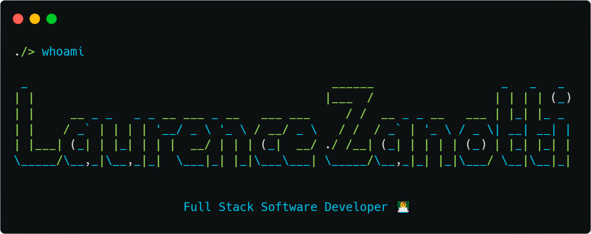

    

        
    

[Versão em Português](README_ptbr.md)

## about-me-cli

    ./> interests --list

    1. Full Stack Web Development
    2. Mobile Development
    3. AI

    ./> courses --attending

    • Análise e Desenvolvimento de Sistemas - Universidade Estácio de Sá (UNESA)
    • HarvardX CS50's Web Programming with Python and JavaScript

    ./> courses

    • HarvardX CS50's Introduction to Computer Science
    • ETEC - Computer Technician

    ./> projects

    • Jobfindr - Job search and talent acquisition platform (WIP)
    • FollowPhone - Contact management and tracking (CRM app)
    • Finance - Simulation of buying and selling shares
    • Countfin App - Personal finance control app

## Reach me
    
### Socials

* [Instagram](https://www.instagram.com/laurencezanotti/)
* [LinkedIn](https://www.linkedin.com/in/laurence-zanotti/)

### Email 

* laurencezanotti@gmail.com

<!--
**LaurenceZanotti/LaurenceZanotti** is a ✨ _special_ ✨ repository because its `README.md` (this file) appears on your GitHub profile.

Here are some ideas to get you started:

- 🔭 I’m currently working on ...
- 🌱 I’m currently learning ...
- 👯 I’m looking to collaborate on ...
- 🤔 I’m looking for help with ...
- 💬 Ask me about ...
- 📫 How to reach me: ...
- 😄 Pronouns: ...
- ⚡ Fun fact: ...
-->
