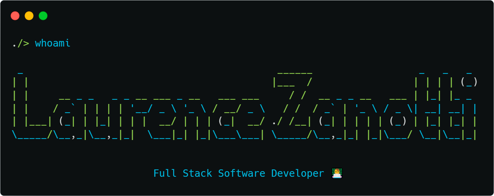

    

        
    

[Versão em Português](README_ptbr.md)

## about-me-cli

    ./> interests

    1. Cloud-native Application Development
    2. Product and software engineering
    3. Personal Knowledge Management, PKM (I'm Obsidian-obsessed!)

    ./> courses

    • Análise e Desenvolvimento de Sistemas - Universidade Estácio de Sá (UNESA)
    • HarvardX CS50's Computer Science for Web Programming
    • ETEC - Computer Technician

    ./> projects

    • AI Chat - LLM powered chat that allows for shareable conversations ¹
    • Obsync - Multi-remote sync tool to keep my Obsidian knowledge updated everywhere
    • Finance - Simulation of buying and selling shares
    • Countfin App - Personal finance control app

## Links

- HarvardX CS50's Computer Science for Web Programming: [professional certificate](https://credentials.edx.org/credentials/45bcb6b8851a4879b2a43cb01688bfaa/)
- ¹ **AI Chat** project was coded without AI -- a [gold standard](https://cs50.harvard.edu/x/honesty/) to pass Harvard CS50's [professional program](https://www.edx.org/certificates/professional-certificate/harvardx-computer-science-for-web-programming)

## Reach me
    
### Socials

* [Instagram](https://www.instagram.com/laurencezanotti/)
* [LinkedIn](https://www.linkedin.com/in/laurence-zanotti/)

### Email 

* laurencezanotti@gmail.com
