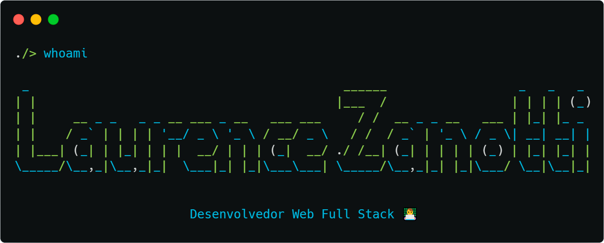

    

  
[English version](README.md)

## sobre-mim-cli

    ./> interesses --lista

    1. Desenvolvimento Web Full Stack
    2. Desenvolvimento Mobile
    3. IA

    ./> cursos --atendendo

    • Análise e Desenvolvimento de Sistemas - Universidade Estácio de Sá (UNESA)
    • HarvardX CS50's Web Programming with Python and JavaScript

    ./> cursos

    • HarvardX CS50's Introduction to Computer Science
    • ETEC - Técnico de Informática

    ./> projetos

    • Jobfindr - Plataforma de procura de empregos e aquisição de talentos (em andamento)
    • FollowPhone - Controle e acompanhamento de contatos (CRM app)
    • Finance - Simulação de compra e venda de ações
    • Countfin App - App para controle de finanças pessoais

## Contato
    
### Redes sociais

* [Instagram](https://www.instagram.com/laurencezanotti/)
* [LinkedIn](https://www.linkedin.com/in/laurence-zanotti/)

### Email 

* laurencezanotti@gmail.com

<!--
**LaurenceZanotti/LaurenceZanotti** is a ✨ _special_ ✨ repository because its `README.md` (this file) appears on your GitHub profile.

Here are some ideas to get you started:

- 🔭 I’m currently working on ...
- 🌱 I’m currently learning ...
- 👯 I’m looking to collaborate on ...
- 🤔 I’m looking for help with ...
- 💬 Ask me about ...
- 📫 How to reach me: ...
- 😄 Pronouns: ...
- ⚡ Fun fact: ...
-->
